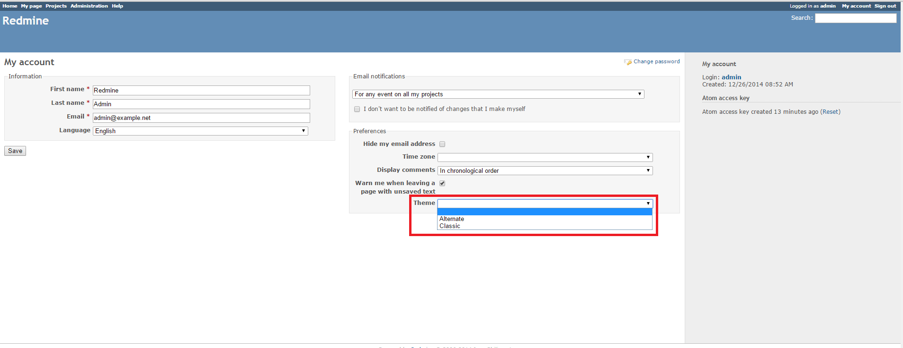

# Redmine User-Specific Theme Plugin

This plugin allows Redmine users to select themes in their account settings. The selected theme will be displayed for the user regardless of the system-wide theme settings.

## Installation

1. To install the plugin
    * Download the .ZIP archive, extract files and copy the plugin directory into *#{REDMINE_ROOT}/plugins*.
    
    Or

    * Change you current directory to your Redmine root directory:  

            cd {REDMINE_ROOT}
 
      Copy the plugin from GitHub using the following command:

            git clone https://github.com/Undev/redmine_user_specific_theme.git plugins/redmine_user_specific_theme

2. Update the Gemfile.lock file, the local package index and install the dependencies:  

         rm Gemfile.lock  
         sudo apt-get update  
         sudo apt-get install libxml2-dev libxslt-dev
         bundle install

3. Restart Redmine.

Now you should be able to see the plugin in **Administration > Plugins**.

## Usage

The plugin adds the **Theme** setting to the user account. If the **Theme** setting is blank, then the system-wide theme is applied; otherwise, the user-specific theme is displayed.

## License

Copyright (c) 2014 Undev

Licensed under the Apache License, Version 2.0 (the "License");
you may not use this file except in compliance with the License.
You may obtain a copy of the License at

http://www.apache.org/licenses/LICENSE-2.0

Unless required by applicable law or agreed to in writing, software
distributed under the License is distributed on an "AS IS" BASIS,
WITHOUT WARRANTIES OR CONDITIONS OF ANY KIND, either express or implied.
See the License for the specific language governing permissions and
limitations under the License.